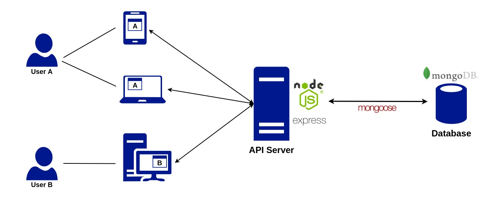
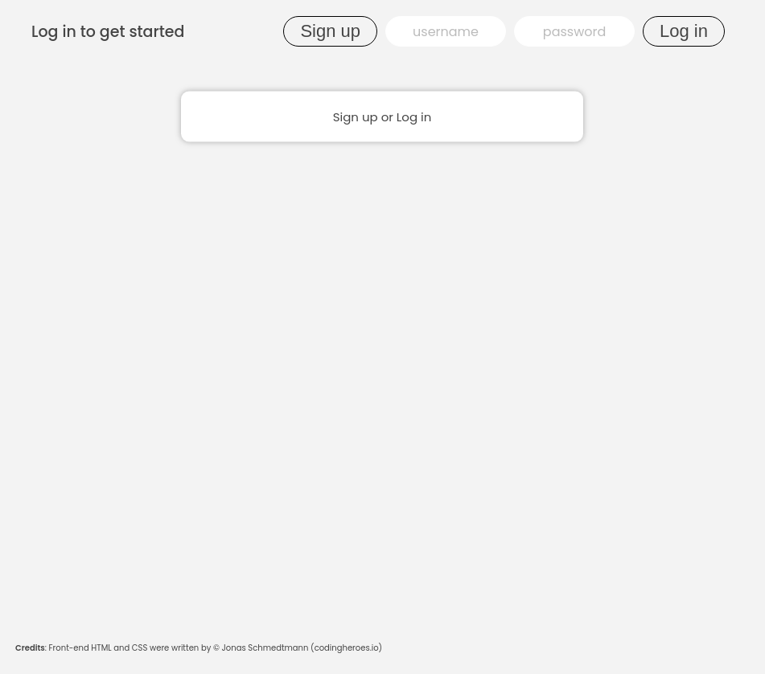
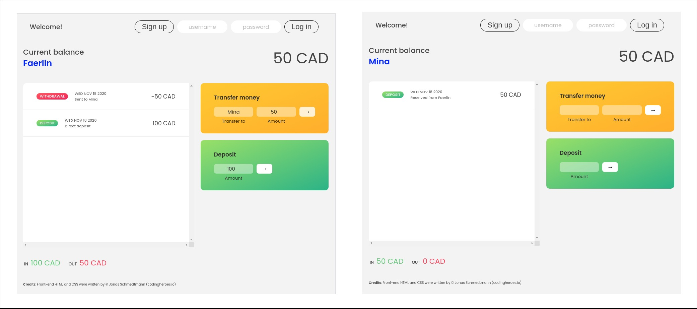

# Minimalist Bank App

The application is implemented using JavaScript with a **Node.js** runtime, **Express** web framework and **MongoDB** database modelled via **Mongoose**. Additionally, real-time communication was achieved using **Socket.io** and user authentication was implemented using **JSON Web Tokens** with `bcrypt`. This is a personal project to hone my skills in back-end web development.



The front-end HTML page and its CSS style sheet were adapted from the course material of Jonas Schmedtmann ([codingheroes.io](codingheroes.io)). The DOM manipulations and the HTTP fetch calls on the front-end were written by me.

## **How To Run**

These instructions will get you a copy of the project up and running on your **local machine**.

### **Prerequisites**

Before proceeding, install the following in the order shown:

- Docker Engine (https://docs.docker.com/engine/install/)
- Docker Compose (https://docs.docker.com/compose/install/)

### **Deploy on Local Machine**

Clone the repository and change directory into the cloned folder.

```bash
$ git clone https://github.com/faerlinpulido/minimalist_bank_app.git
$ cd minimalist_bank_app
```

The deployment of the application has been dockerized for your convenience. Deploy the application on your local machine:

```bash
$ docker-compose up
```

This will run two containers `node` and `mongo`. Refer to [docker-compose.yml](https://github.com/faerlinpulido/minimalist_bank_app/blob/master/docker-compose.yml) for more details on these containers.

To start a session, open up `localhost:3000` on a browser.

## **How To Use**

To use the application, you must first create an account. Enter a **username** and **password** and click the **Sign Up** button. You can create multiple accounts and are uniquely identified by their usernames. Passwords must be 4 or more characters in length. Signing up an account also automatically logs you in.



Once logged in, you can increase your balance by making a deposit. Simply enter an amount under **Deposit** and press enter. You can also send money to other users. To see this in action, open another window and sign up for another account. From one of these accounts, fill in the **Transfer To** (i.e. username of receiver) and **Amount** fields then press enter.



## **Built With**

- [Node.js](https://nodejs.org/en/)
- [Express](http://expressjs.com/)
- [MongoDB](https://www.mongodb.com/)
- [Mongoose](https://mongoosejs.com/)
- [Socket.io](https://socket.io/)

## **References**

The front-end HTML page and its CSS style sheet were adapted from the course material of Jonas Schmedtmann ([codingheroes.io](codingheroes.io)).
